<p align="center">
  
</p>

<h1 align="center">DEDSEC // CODE AUDIT SYSTEM</h1>

<p align="center">
  <strong>We are watching your code.</strong><br/>
  Static analysis for style, memory safety, security and quality.
</p>

<p align="center">
  
  
  
</p>

---

## What it does

Upload or paste source code — DEDSEC runs:

| Module | Checks |
|--------|--------|
| **clang-format** | Style / formatting (if `clang-format` installed) |
| **memory** | malloc/free imbalance, unsafe string funcs, new/delete |
| **security** | command injection, hardcoded secrets, weak crypto, XSS, SQL patterns |
| **quality** | long lines, TODO/FIXME, comment ratio |

## Quick start

```bash
git clone https://github.com/fightmeb1tch99-ux/dedsec-scanner.git
cd dedsec-scanner
pip install -r requirements.txt

# CLI
python scanner.py path/to/file.c -v

# Web UI (DedSec style)
python app.py
# open http://localhost:5000
```

### CLI options

```
python scanner.py <file>          # human report
python scanner.py <file> -v       # verbose issues
python scanner.py <file> -j       # JSON output
```

Exit codes: `0` clean · `1` issues · `2` critical

## Example

```bash
$ python scanner.py vuln.c -v

 ____  _____ ____  ____  _____ ____
|  _ \| ____|  _ \/ ___|| ____/ ___|
...
[*] TARGET: vuln.c

  [+] CLANG_FORMAT   PASS       Style OK
  [-] MEMORY         FAIL       3 memory-related warning(s)
       L  12 [memory] strcpy is unsafe — use strncpy/strlcpy
  [!] SECURITY       CRITICAL   2 security issue(s) — CRITICAL found
       L  20 [critical] gets() — buffer overflow, never use
  [~] QUALITY        WARN       1 quality note(s)
```

## Stack

- Python 3.9+
- Flask (web UI)
- Optional: `clang-format` for style checks

## Roadmap

- [x] CLI scanner
- [x] Web UI (DedSec / glitch style)
- [x] Security + memory + quality rules
- [ ] clang-tidy / cppcheck integration
- [ ] Multi-file / project scan
- [ ] SARIF export
- [ ] GitHub Action

## License

MIT — use it, fork it, break the system.

---

<p align="center">
  <code>[ DEDSEC // FOLLOW THE RULES OF THE INTERNET ]</code>
</p>
